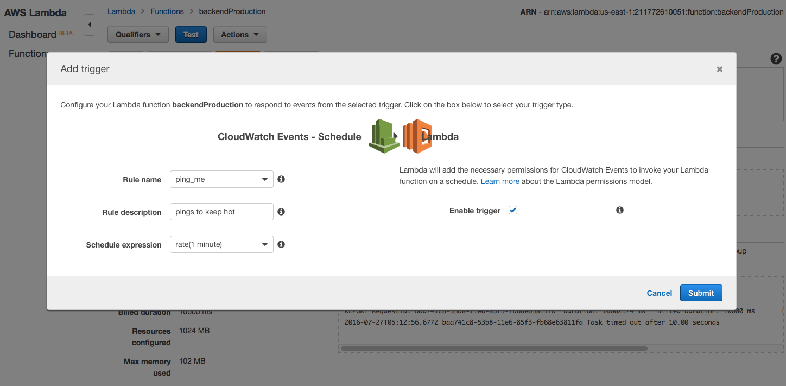
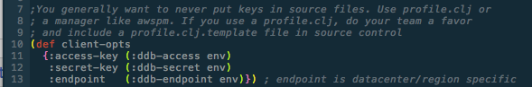
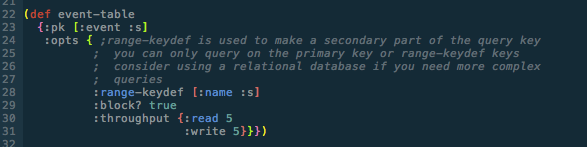

# Clojure & AWS Lambda: Serverless in the Realm of the Wild Paren 

---
# Who?
---

###Michael Langford

###@mj_langford on twitter

###michael.langford@rowdylabs.com

###iOS + Clojure + Creating an App Business

---

# What?

---

#This is a talk about AWS Lambda: Its business case and its technical use.

---

#Lambda is a 64-bit Linux compute environment that runs JVM, Node or Python code.

---

#Designed to be used as "functions" 

* Which really are microservices* 

* Especially on the JVM

---

#Can run in 1-2ms increments and Amazon will bill you for nothing but those 1-2ms 

---

#Can be Called From: 
IoT buttons, Amazon Echo, Web Requests, Things being added to various databases, notifications, queues filling up, the command line, code on client machines, other Lambda functions, etc

---

#Why?

---

#Your Pain Points:

* Slow code because you don't have enough computers to run it quickly 

* Dying servers

* Capacity increasing is manual/hard/slow 

* Code that costs thousands per month to "run", when mostly idle

---
#More Pain Points:

* Sleep you don't get because you're on call if the servers go down

* Angry clients you lose because the servers went down

* Crunch time at work to rearchitect for scale 

---

#An End To These Pains?

---

#Some of them 

- Not enough computers: Solved

- Servers failing: Solved (kinda)

- Too Long to Add Capacity: Solvable

- Cheap to run per month: (kinda, but at what price)

---
#Some of them 

- Sleep due to pager duty, etc: Solved (mostly)

- Angry clients due to failing servers: Solved

- Crunch time at work due to rearchitecting: Solved

---

#What about cost? 

- $$$? 

- Cold hard cash? 

---

#Kinda?

- You're building for scale from the get-go when you're choosing this different, constrained architecture.

- Slower work at first to save on scaling later. 

- Possible loss for any organization continually staffed by software developers and system administrators (at first).

---

#But in some cases...

- "Continually staffed" is the kicker though. 

- Like many "autoscaling" PaaSs, it's a superior tool for companies without an immediate support structure.

- Mobile gets fewer "second chances" when it fails to scale.

---

#Alternatives that also solve some of these pains

- Older PaaS (there are tons, but Google App Engine and Heroku are two examples)

- Scaling Clouds (even AWS products like ElasticBeanStalk)

- Backend as a Service (Cloudkit, Firebase, Parse)

----

#Advantages over those:

- Less ability to fail in a way that looks bad.

- Dedicated to autoscaling architecture.

- Less vulnerable to a BaaS going out of business (Parse).

- Simpler client software when logic in the cloud (compared to Baas).

- Designed for connection to everything without coding it yourself.

---

#How?

---

#Some Architectures

(user) <-> (software client) <-> (lambda) <-> (dynamodb)

(user) <-> (software client) <-> (api gateway) <-> (lambda) <-> (dynamodb)

---

#Some More Architectures

(user) <-> (IoT Button) --> (simple queue service) <-> (lambda) <-> (dynamodb) <-> (analytics user)

(user) <-> (software client) <-> (api gateway) <-> (lambda) <-> (relational database)

---

# Still More Architectures

(user) <-> (software client) --> (s3 bucket) --> (lambda) --> (another s3 bucket)

(user) --> (software client) --> (simple queue service) --> (lambda) --> (simple notification service) --> (software client) --> (another person)

---

# The One We're Doing Tonight 

(user) --- (software client) --- (api gateway) --- (lambda) --- (dynamodb)

---

# So let's write a system using this architecture

Melvin: signs up for an event

Sees himself and others that have signed up for the event

Meets people at the event, doing the activity

---

# Skipping IAM setup

 * Identity Access Management

 * Running the commands in this presentation will require a overprivledged user

 * Delegate most of these privledges to your CI tool and constrain the dev roles

 * http://docs.aws.amazon.com/lambda/latest/dg/intro-permission-model.html

---

# Our story so far 

(person:Melvin) --- (software client) --- (api gateway) --- (lambda) --- (dynamodb)

---

# Software Client

---

# Let's do a simple JSON API with curl

(user:Melvin) --- (software client:command line client script) --- (api gateway) --- (lambda) --- (dynamodb)

---

# Let's talk about the pain points now.

Wow, Amazon API Gateway hurts. It's hard to configure sensibly, doesn't propogate HTTP errors well, and is just super raw in many places.

---

# What is it in theory?

* You use a web GUI or swagger specification file to specify a bunch of endpoints, including what http methods work on it

* You deploy it

* You assign other AWS services to handle the requests coming in, and return appropriate status codes

----

# What is it in practice?

* You use a very hard to use, somewhat mis-documented GUI that is light on examples.

* Oriented towards JSON-style APIs, not HTTP param-type APIs.

* Opaque when it fails.

* The ring adapter requires a wierd pile of JS to paste in there.

----

# What are the good parts?

* HTTPS by default.

* Able to use custom authorizers or Cognito (Amazon's user authentication system).

* Reasonable to tie into CloudFront.

* Can dispatch to EC2 servers, Lambda, or a mix.

* Generates "okay" iOS/Android/JS API.

---

# Tricks:

- Configure them in the order specified in jpb/ring-aws-lambda-adapter's readme
- Look at the names in the upper right while selecting a method on a resource 
- Copy that large block of JS, because they say to.
- You can't export YAML until you deploy, chose YAML for swagger + api
- Edit the YAML and use lein aws-api-gateway update

---

# The Story So Far 

(user:Melvin) --- (software client:Cljs client project) --- (api gateway:arctic-fun-times-api) --- (lambda) --- (dynamodb)

---

# Lambda

---

# LAMBDA (finally)

Can be a JVM, Node or Python (2.7) "function" 

Think of the "function" as the entry point into a microservice...I'll get back to why it's not a function.

---

# Do not use: 

gen-class example from amazon/pojo example

---

# Probably do not use:

Lambada  (the extra 'a' is not a typo)

---

# Instead: ring adapter lambda (less hard way)

https://github.com/jpb/ring-aws-lambda-adapter

---

#Why Ring Adapter Lambda:

* You can write what works locally as a web app...and on AWS as a Lambda function. 

* Main is entirely for running locally.

* In theory, I guess you could deploy the app to EC2/EBS if you want...or Lambda.

---

# Amazon puts your code on ice and shuts down the handlers if it ever isn't called enough

Which isn't a huge problem for node or python...but for JVM langs this is death. 

---

# Not just slow? 

No, death. The API Gateway has a hard timeout of 10 seconds. If you don't return in 10 seconds, it errors out. 

---

# That's actually too slow to start up some Clojure servers on Lambda

Oi. So what's the remedy?

---

#The Fix: 

* After deploy, invoke the function once

* Have your "function" called once a minute (eats 1/3 of your "free" calls)

---

# The Story So Far 

(user:Melvin) --- (software client:command line client script) --- (api gateway:arctic-fun-times-api) --- (lambda:backendProduction) --- (dynamodb)

---

# DynamoDB

---

# DynamoDB

* Lambda sometimes drowns traditional relational DBs with connection attempts.

* DynamoDB is not necessary, nor always desired, but it works for many projects.

* Limited cross table queries, weird primary keys, among other oddities.

---

# The Process:x

Create a table, specifying how many concurrent readers and writers we want (to pay for), as well as the weird primary key (plus any secondary "keys" we need to query on).

---
# Client Opts: Where the DB is + login keys

---
# DynamoDB Table Creation Minutia

---
# Ensure the table is there on every execution to pick up changes

---

# The Story: Fin

(user:Melvin) --- (software client:command line client script) --- (api gateway:arctic-fun-times-api) --- (lambda:backendProduction) --- (dynamodb:Events)

---
# Neglected Topics

- IAM

- Testing

- Production/Staging Separation

- Local DynamoDB

- CloudWatch

- User Management

- JSON Client App

---

#Demo

Code: https://github.com/langford/clj-aws-lambda-example

---

#Thanks!

---

References: See the code for all the libraries, clojars/github for lambada

---

###Michael Langford

###@mj_langford on twitter

###michael.langford@rowdylabs.com

###iOS + Clojure + Creating an App Business

---

